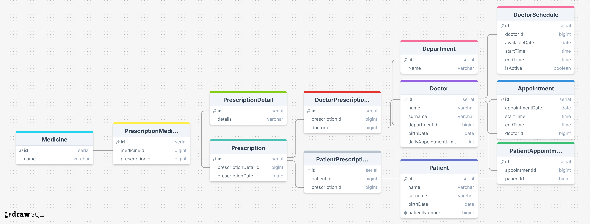

## **PostgreSQL-Hospital-Management-System**
It offers a relational PostgreSQL database model that manages patient, doctor, appointment and prescription processes in hospital management systems.

## **İçindekiler**
- [Schema](#Schema)
- [Tables](#tables)
- [Functions](#functions)
- [Triggers](#triggers)
- [Stored Prosedures](#stored-prosedures)
- [Views](#views)
- [Complex Queries](#complex-queries)
## **Schema**

## **Tables**
- Department
- Doctor
- Patient
- Appointment
- DoctorSchedule
- PatientAppointments
- DoctorPrescriptions
- PatientPrescriptions
- PrescriptionDetail
- Prescription
- PrescriptionMedicines
- Medicine
## **Functions**
- **calculate_doctor_workload** : It is the function that calculates the number of monthly appointments of a doctor.
- **patient_age** : It is the function that allows calculating the patient's age.
- **available_doctors** : It is a function that calculates available doctors by department and date.
## **Triggers**
- **trg_set_patient_number** : It is a trigger function that automatically generates a patient number when a patient is added.
- **set_prescription_date** : If the prescription date is not entered, it is the trigger function that assigns the current date as the prescription date.
## **Stored Prosedures**
- **sp_create_appointment** : It is a stored procedure that allows you to create an appointment.
- **sp_create_prescription** : It is a stored procedure that allows creating prescriptions and adding medications.
## **Views**
- **vw_doctor_department_appointment_count** : View showing doctors' departments and total number of appointments.
- **vw_patient_detail_appointment** : View showing patients' appointment history in detail.
## **Complex Queries**
- Query showing patient numbers and average appointment times by department.
- Query that gives the number of most prescribed drugs.
- Query that returns doctors with more appointments than average.